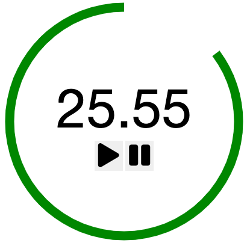

# Overview

Timer application is made of pure Javascript.

- When the user clicks the play button, the timer will start counting down the time. Also, the user can stop the time by clicking the pause button.
- The user can click on the number and change the timer countdown duration.

Take a look at a mockup and get a better idea of project. -> https://app.diagrams.net/#G1m3PfCdeQcD8vKYeIPpIvb_Zq4nu3sYrZ
